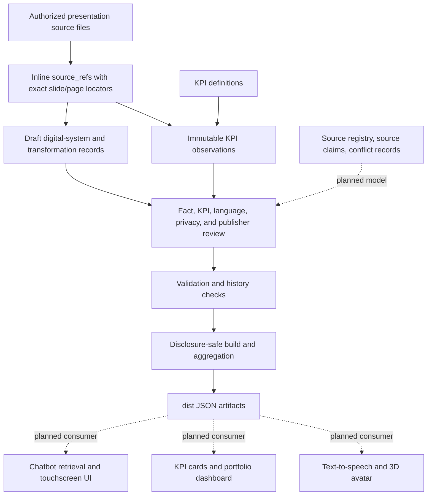
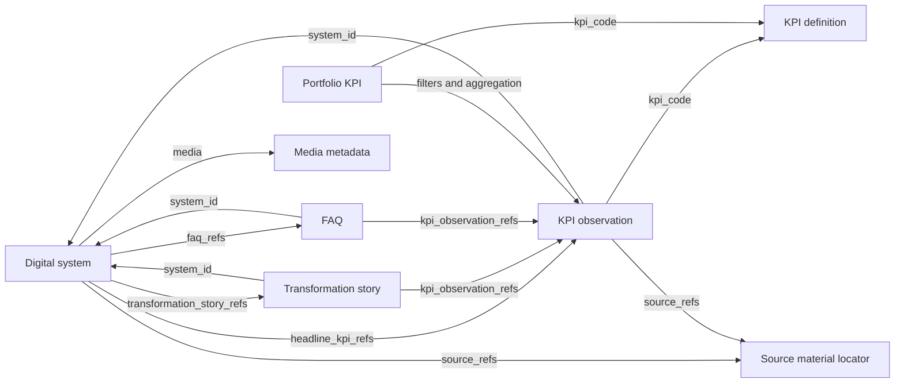
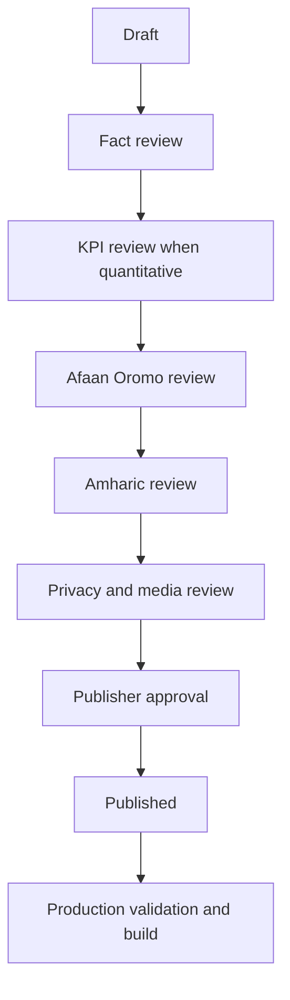

<a id="top"></a>
# OSTA Exhibition Knowledge Base

This repository is the controlled, source-grounded knowledge foundation intended for the future OSTA exhibition assistant: its chatbot answers, KPI dashboard, bilingual speech experience, and three-dimensional avatar. It is written for content authors, reviewers, translators, organizational managers, and technical maintainers—not only software developers.

The repository separates reviewed knowledge from application code. It currently models digital systems, KPI definitions, immutable KPI observations, portfolio metrics, transformation stories, FAQ references, source evidence, review state, and public-build controls. Additional organizational, service, training, glossary, source-claim, and conflict models are planned and are identified as such throughout this guide.

> [!IMPORTANT]
> Repository presence is not publication approval. The six systems, their successor KPI observations, and their approved Oromo and Amharic translations are marked published under recorded organizational-leadership and language-review authorization. Only validated, reviewed, verified, public-classified, non-personal, explicitly display-approved content can enter the public build.

<a id="repository-status"></a>
## Repository Status

- **Model version:** `1.0.0`, declared in [`pyproject.toml`](pyproject.toml).
- **Current structured content:** six published digital-system records plus 30 ETEX 2025 draft system records, 30 active and 15 draft KPI definitions, nine legacy draft observations plus nine published successor observations and 34 ETEX 2025 draft observations, 11 active portfolio-dashboard configurations, eight draft transformation stories, and seven draft FAQs. Each published system has approved Afaan Oromo and Amharic translations.
- **Current build:** one disclosure-safe production build generated by `python scripts/kpi_pipeline.py build`.
- **Reviewer build:** **planned, not implemented**. Reviewers currently inspect source YAML and run validation/tests; there is no reviewer-bundle command or artifact.
- **Automation:** no Makefile, GitHub Actions workflow, dedicated lint command, or `osta-kb` executable currently exists.
- **Repository hosting:** Git repository with `main` as the default branch, hosted privately at [`naolselemon/osta-exhibition-knowledge-base`](https://github.com/naolselemon/osta-exhibition-knowledge-base). PowerPoint and PDF source presentations are explicitly Git-ignored and are not hosted there. No CODEOWNERS file, pull-request template, issue forms, or GitHub workflow currently exists, so no workflow badge is shown.

| Term | Current meaning |
| --- | --- |
| Draft content | A source record marked `draft`, `needs-review`, internal, or not approved for display. It remains authoring/review material. |
| Reviewer build | Planned capability for packaging drafts and warnings. It does not exist yet. Use source YAML plus `validate` and tests for review today. |
| Production build | The current `build` command. It filters to eligible public records and writes the four JSON artifacts under [`dist/`](dist/). |

<a id="table-of-contents"></a>
## Table of Contents

1. [Repository Status](#repository-status)
2. [Repository Purpose](#repository-purpose)
3. [What This Repository Contains](#repository-contains)
4. [What This Repository Does Not Contain](#repository-does-not-contain)
5. [How the Knowledge Base Supports the Exhibition](#exhibition-support)
6. [Who Should Use This Repository](#who-should-use)
7. [Quick Start by Contributor Role](#quick-start)
8. [Knowledge Flow and Architecture](#knowledge-flow)
9. [Repository Folder Map](#folder-map)
10. [Detailed Folder Responsibilities](#folder-responsibilities)
11. [Content Types and Relationships](#content-relationships)
12. [Source Evidence and Traceability](#source-evidence)
13. [KPI Management](#kpi-management)
14. [Bilingual and Avatar-Ready Content](#bilingual-avatar-content)
15. [Common Contribution Workflows](#contribution-workflows)
16. [Validation, Testing, and Building](#validation-testing-building)
17. [Git and Pull-Request Workflow](#git-pull-request)
18. [Review and Publication Lifecycle](#review-publication)
19. [Security, Privacy, and Public Display](#security-privacy)
20. [Generated Outputs](#generated-outputs)
21. [Naming and File Conventions](#naming-conventions)
22. [Common Mistakes](#common-mistakes)
23. [Troubleshooting](#troubleshooting)
24. [Documentation Map](#documentation-map)

<a id="repository-purpose"></a>
## Repository Purpose

The exhibition is intended to explain real digital systems, services, training programs, measurable achievements, user impact, live demonstrations, supporting photographs/videos, and before-versus-after transformation in reliable Afaan Oromo and Amharic. Those facts and media references change on a different schedule from chatbot, speech, interface, and avatar software.

Keeping knowledge in a separate repository allows:

- content updates without changing chatbot application code;
- fact and source review by non-developers;
- independent language review;
- immutable historical KPI tracking;
- exact source traceability and visible limitations;
- filtering before public release;
- reuse by future chatbot retrieval, dashboards, text-to-speech, and avatar experiences.

The central rule is simple: **the source says what was reported; a reviewer decides what is verified; the build decides what is eligible for public output.** A dashboard value is never a marketing placeholder.

[Back to top](#top)

<a id="repository-contains"></a>
## What This Repository Contains

### Current

- structured YAML for digital systems, KPI definitions, KPI observations, portfolio KPI configurations, transformation stories, and FAQs;
- inline source references with source IDs, repository paths, exact locators, verification state, and display approval;
- a tracked directory contract for authorized source evidence supplied locally; presentation binaries are Git-ignored and absent from GitHub;
- JSON Schemas for every current record type;
- contributor templates;
- validation, immutability, aggregation, disclosure, and build tooling;
- behavioral tests;
- generated public JSON artifacts;
- detailed KPI and transformation-story guides.

### Planned, not yet modeled

- standalone organization, service, training-program, achievement, glossary, source-claim, and conflict records;
- a source registry with hashes and source-level authorization metadata;
- richer visitor-facing bilingual fields and pronunciation metadata;
- reviewer-build artifacts and repository-hosting automation.

Planned capabilities are not valid authoring targets until their folders, templates, schemas, validation, and tests exist.

<a id="repository-does-not-contain"></a>
## What This Repository Does Not Contain

This repository does **not** contain the chatbot backend, touchscreen frontend, 3D model, animation engine, speech-to-text engine, text-to-speech engine, vector database, embeddings, or production deployment configuration. It must not contain production credentials, citizen records, employee records, or other personal datasets.

The separation limits accidental disclosure, lets domain reviewers work without application-code access, and gives consuming applications a small validated JSON contract rather than arbitrary access to authoring files and source binaries.

[Back to top](#top)

<a id="exhibition-support"></a>
## How the Knowledge Base Supports the Exhibition

The current build path is solid; downstream exhibition applications are planned:



KPI cards obtain values from structured KPI observations. Current FAQ answers can embed `{{kpi:observation-id}}`; the builder resolves that token from the authoritative observation. Contributors must not copy the same changing number into system descriptions and several FAQ answers.

The intended future avatar contract includes approved `spoken_text`. That field is **not in the current schemas**. Today, [`dist/avatar-facts.json`](dist/avatar-facts.json) exports only approved systems, FAQs, verified public KPI observations, approved translations, reporting dates, source labels, and headline KPI references. Lip-sync and animation remain application concerns.

<a id="who-should-use"></a>
## Who Should Use This Repository

No CODEOWNERS file currently assigns people to these roles. The table defines the responsibilities needed for a safe workflow; it does not appoint owners. Follow [`contributing.md`](contributing.md) for the shared contribution rules.

| Role | Primary responsibility | Normally edits | Normally reviews | Expected output | Workflow |
| --- | --- | --- | --- | --- | --- |
| Content author | Normalize source-supported system and story content. | `content/digital-systems/`, `content/transformation-stories/`, `content/faqs/` | Own draft for completeness | Traceable draft records | [Content Author](#quick-content-author) |
| Source curator | Preserve authorized files and precise evidence locations. | `source-materials/`; inline `source_refs` | Source path, locator, and authorization | Stable source evidence | [Source Evidence](#source-evidence) |
| Fact reviewer | Compare normalized statements with source evidence. | Review metadata only when authorized | System, story, and FAQ claims | Verified fact decision or correction request | [Fact Reviewer](#quick-fact-reviewer) |
| KPI reviewer | Verify definitions, values, periods, scope, units, and aggregation. | KPI review/status metadata; new corrective observations | `content/kpi-definitions/`, `content/kpi-observations/`, `content/portfolio-kpis/` | Verified KPI or documented conflict | [KPI Reviewer](#quick-kpi-reviewer) |
| Afaan Oromo reviewer | Approve meaning, terminology, and natural Afaan Oromo. | `translations.om` approval/content | Afaan Oromo visitor text | Approved or corrected Afaan Oromo | [Afaan Oromo Reviewer](#quick-afaan-oromo-reviewer) |
| Amharic reviewer | Approve human-reviewed Amharic; reject unapproved machine output. | `translations.am` approval/content | Amharic visitor text | Approved or corrected Amharic | [Amharic Reviewer](#quick-amharic-reviewer) |
| Media-rights reviewer | Confirm public-display rights and safe metadata. | Media approval metadata | `media` entries and source authorization | Approved or withheld media | [Security and Privacy](#security-privacy) |
| Privacy reviewer | Prevent personal, confidential, restricted, and sensitive disclosure. | Classification/display decisions | Public candidates and generated output | Public-suitability decision | [Security and Privacy](#security-privacy) |
| Publisher | Authorize release after required reviews. | Publication and display status | Final eligible record set | Approved public release | [Publisher](#quick-publisher) |
| Technical maintainer | Maintain schemas, validator, builder, and tests. | `schemas/`, `scripts/`, `tests/`, `pyproject.toml` | Model migrations and build changes | Compatible, tested tooling | [Technical Maintainer](#quick-technical-maintainer) |
| Repository administrator | Manage future hosting, access, protections, and ownership. | Planned `.github/` configuration | Access and merge controls | Controlled repository operations | [Git and Pull Requests](#git-pull-request) |

[Back to top](#top)

<a id="quick-start"></a>
## Quick Start by Contributor Role

<a id="quick-content-author"></a>
### Content Author

1. Locate an authorized source under [`source-materials/`](source-materials/).
2. Copy the matching file from [`templates/`](templates/); do not author the structure from memory.
3. Add an inline `source_refs` entry with the stable source ID and exact slide locator. Standalone source-claim records are planned and cannot yet be created correctly.
4. Create or update the subject record without copying KPI values into prose.
5. Add a separate observation under [`content/kpi-observations/`](content/kpi-observations/) for each sourced KPI and reporting period.
6. Keep missing information explicit in a **draft** using `unknown`, `not-specified`, limitations, or a clearly scoped TODO note. Never publish placeholders.
7. Follow the [KPI authoring guide](docs/kpi-authoring-guide.md), then run the [pre-PR checks](#recommended-pre-pr-check).
8. Submit one focused pull request from a topic branch; no pull-request template currently exists.

<a id="quick-fact-reviewer"></a>
### Fact Reviewer

1. Open the referenced source and exact locator.
2. Compare names, descriptions, dates, numbers, operators, units, scope, and lifecycle claims with the source.
3. Distinguish what the source literally reports from the author's interpretation.
4. Request correction or record ambiguity; do not silently improve a claim.
5. Mark evidence verified only after the source, context, and normalized statement agree.
6. Avoid rewriting reviewed language merely for personal style; send language issues to the relevant language reviewer.

<a id="quick-kpi-reviewer"></a>
### KPI Reviewer

1. Confirm the `kpi_code` definition matches the reported concept.
2. Confirm the system and `measurement_scope` identify the correct subject.
3. Review `actual`, `baseline`, and `target` independently; assess `achievement` only when a target exists.
4. Verify operator, value, unit, reporting period, method, and source locator.
5. Check activity windows, monitoring periods, statistics, and data-quality limitations.
6. Identify overlapping users, services, records, institutions, systems, or periods.
7. Apply the [aggregation rules](docs/kpi-aggregation-rules.md); never sum percentages or active users across systems.

<a id="quick-language-reviewers"></a>
### Language Reviewers

<a id="quick-afaan-oromo-reviewer"></a>
#### Afaan Oromo Reviewer

Review the `om` translation for meaning, approved terminology, spelling, natural speech, and any future pronunciation hints. Approve only content you reviewed or content traceable to an approved source. Current storage uses `om`; downstream applications should map it to `om-ET`.

<a id="quick-amharic-reviewer"></a>
#### Amharic Reviewer

Review the `am` translation for meaning, terminology, spelling, and natural speech. Current validation requires an approved source or explicit approval from `human-amharic-reviewer`. Machine-generated Amharic must remain unapproved. Current storage uses `am`; downstream applications should map it to `am-ET`.

<a id="quick-publisher"></a>
### Publisher

1. Confirm fact, KPI, language, privacy, and media decisions are complete for the material being released.
2. Confirm each public KPI has a verified source, reporting period, unit, public classification, no personal data, and display approval.
3. Confirm each published system has a verified public headline KPI or an approved data-unavailable exception.
4. Run validation, tests, and the production build.
5. Inspect generated output before authorizing release.

<a id="quick-technical-maintainer"></a>
### Technical Maintainer

Maintain [`schemas/`](schemas/), [`scripts/kpi_pipeline.py`](scripts/kpi_pipeline.py), [`tests/`](tests/), and [`pyproject.toml`](pyproject.toml). Schema changes need migration reasoning, updated templates, validator changes, regression tests, and clear compatibility impact. Ordinary content problems should be fixed in records—not by weakening a schema for one exception.

[Back to top](#top)

<a id="knowledge-flow"></a>
## Knowledge Flow and Architecture



Authoring YAML is loaded by [`scripts/kpi_pipeline.py`](scripts/kpi_pipeline.py). Validation checks required records, references, KPI semantics, immutable observation hashes, publication gates, translation approval, and public-display safety. The builder then projects only eligible fields into [`dist/`](dist/). Consuming applications should use generated JSON, not arbitrary YAML or source binaries.

<a id="folder-map"></a>
## Repository Folder Map

“Planned” means the folder does not currently exist and must not be used until its model and validation are implemented.

| Folder | Main Purpose | Who Works Here | Why It Is Needed | Detailed Guide |
| --- | --- | --- | --- | --- |
| [`content/`](#folder-content) | Structured authoring records | Authors and reviewers | Separates knowledge from code | [Guide](#folder-content) |
| [`content/organization/`](#folder-organization) — **planned** | OSTA identity and mandate | Fact reviewers and publishers | One authoritative organizational description | [Guide](#folder-organization) |
| [`content/digital-systems/`](#folder-digital-systems) | Digital-system records | Content authors and fact reviewers | Connects systems to services, evidence, and results | [Guide](#folder-digital-systems) |
| [`content/services/`](#folder-services) — **planned** | Organizational service records | Service owners and authors | Separates services from software | [Guide](#folder-services) |
| [`content/training-programs/`](#folder-training-programs) — **planned** | Training-program records | Program owners and KPI reviewers | Models objectives, cohorts, and results | [Guide](#folder-training-programs) |
| [`content/achievements/`](#folder-achievements) — **planned** | Broader sourced achievements | Authors and fact reviewers | Represents outcomes larger than one KPI | [Guide](#folder-achievements) |
| [`content/kpi-definitions/`](#folder-kpi-definitions) | KPI meaning and aggregation contract | KPI reviewers | Gives every value a stable definition | [Guide](#folder-kpi-definitions) |
| [`content/kpi-observations/`](#folder-kpi-observations) | Immutable KPI results | Authors and KPI reviewers | Preserves value, scope, period, and evidence | [Guide](#folder-kpi-observations) |
| [`content/portfolio-kpis/`](#folder-portfolio-kpis) | Dashboard derivation configuration | KPI reviewers and maintainers | Prevents guessed or unsafe totals | [Guide](#folder-portfolio-kpis) |
| [`content/transformation-stories/`](#folder-transformation-stories) | Sourced before-and-after stories | Authors and fact reviewers | Explains impact beyond isolated numbers | [Guide](#folder-transformation-stories) |
| [`content/faqs/`](#folder-faqs) | FAQ records and KPI tokens | Content and language authors | Supports consistent reusable answers | [Guide](#folder-faqs) |
| [`content/glossary/`](#folder-glossary) — **planned** | Terms, aliases, and pronunciation | Language reviewers | Supports consistent recognition and speech | [Guide](#folder-glossary) |
| [`content/source-claims/`](#folder-source-claims) — **planned** | Verbatim extracted claims | Source curators and fact reviewers | Separates raw evidence from normalization | [Guide](#folder-source-claims) |
| [`content/conflicts/`](#folder-conflicts) — **planned** | Unresolved source disagreements | Fact and KPI reviewers | Prevents silent reconciliation | [Guide](#folder-conflicts) |
| [`templates/`](#folder-templates) | Copyable record starting points | All content contributors | Reduces structural authoring errors | [Guide](#folder-templates) |
| [`schemas/`](#folder-schemas) | JSON structural contracts | Technical maintainers | Defines machine-checkable record shapes | [Guide](#folder-schemas) |
| [`source-materials/`](#folder-source-materials) | Local placement for authorized source evidence | Source curators | Keeps private evidence available for local review without publishing it | [Guide](#folder-source-materials) |
| [`source-materials/presentations/`](#folder-source-presentations) | Local, Git-ignored presentation sources | Source curators | Provides evidence to authorized local reviewers without tracking binaries | [Guide](#folder-source-presentations) |
| [`workbench/`](#folder-workbench) — **planned** | Temporary extraction output | Source curators and maintainers | Isolates unreviewed research artifacts | [Guide](#folder-workbench) |
| [`docs/`](#folder-docs) | Detailed policies and guides | Maintainers and policy owners | Keeps the README navigable | [Guide](#folder-docs) |
| [`src/`](#folder-src) — **planned** | Future reusable Python package | Technical maintainers | Would separate library code from wrappers | [Guide](#folder-src) |
| [`scripts/`](#folder-scripts) | Current validator and builder | Technical maintainers | Provides executable repository behavior | [Guide](#folder-scripts) |
| [`tests/`](#folder-tests) | Behavioral regression tests | Technical maintainers | Protects validation and disclosure invariants | [Guide](#folder-tests) |
| [`dist/`](#folder-dist) | Generated public JSON | Builder and downstream consumers | Gives applications a safe stable interface | [Guide](#folder-dist) |
| [`.github/`](#folder-github) — **planned** | Hosting automation and ownership | Repository administrators | Would enforce review and CI controls | [Guide](#folder-github) |

[Back to top](#top)

<a id="folder-responsibilities"></a>
## Detailed Folder Responsibilities

<a id="folder-content"></a>
### `content/`

**Purpose.** [`content/`](content/) is the source-of-truth authoring area for structured knowledge records.

**Who normally edits it.** Content authors and authorized fact, KPI, language, privacy, and publisher reviewers.

**What belongs here.** YAML records in an implemented, schema-backed child folder.

**Why this folder is necessary.** It separates reviewable knowledge from tooling, generated output, and source binaries.

**Typical contributor actions.** Copy a template, author a draft, add exact references, run validation, and request review.

**Required relationships.** IDs must resolve across current content collections; public values must trace to source references.

**Do not.** Do not invent new unschematized child folders or treat a draft as public.

**Related templates and guides.** [`templates/`](templates/), [`schemas/`](schemas/), and the [documentation map](#documentation-map).

<a id="folder-organization"></a>
### `content/organization/` — planned, not present

**Purpose.** The planned folder will hold OSTA-level identity, official descriptions, mandates, and organizational content.

**Who normally edits it.** Authorized content authors; fact reviewers and publishers approve it.

**What belongs here.** Source-supported organization identity and mandate records once a template/schema exists.

**Why this folder is necessary.** It will prevent organization-wide facts from being duplicated in system records.

**Typical contributor actions.** None yet. A technical maintainer must introduce the model before content is authored.

**Required relationships.** Planned records should reference source evidence and be reused by services, systems, and achievements.

**Do not.** Never invent an official mandate, description, owner, or organizational claim.

**Related templates and guides.** No organization template, schema, or guide currently exists.

<a id="folder-digital-systems"></a>
### `content/digital-systems/`

**Purpose.** [`content/digital-systems/`](content/digital-systems/) identifies each digital system and its role.

**Who normally edits it.** Content authors; fact, privacy, language, and publisher reviewers.

**What belongs here.** Official name, acronym, category, lifecycle and publication status, owner organization, classification, purpose, beneficiaries, digitized services, integrations, geographic coverage, KPI/story/FAQ references, media, translations, source evidence, and workflow state. The current collection file holds multiple draft systems; one primary record per file is recommended for future independent review but is not enforced.

**Why this folder is necessary.** It gives the exhibition one stable system identity while keeping changing results in observations.

**Typical contributor actions.** Add or correct sourced metadata, connect headline observations, and update references after review.

**Required relationships.** `headline_kpi_refs` point to observations for the same `system_id`; story and FAQ IDs must exist.

**Do not.** Do not paste achievement numbers into `purpose` or service descriptions; do not claim operational status without evidence.

**Related templates and guides.** [Digital-system template](templates/digital-system.template.yml), [schema](schemas/digital-system.schema.json), [KPI data dictionary](docs/kpi-data-dictionary.md), and [new-system workflow](#workflow-new-system).

<a id="folder-services"></a>
### `content/services/` — planned, not present

**Purpose.** The planned folder will model organizational services independently of the systems that support them.

**Who normally edits it.** Service owners, content authors, and fact reviewers.

**What belongs here.** Service identity, eligibility, channel, process, owner, evidence, and related-system references after a model exists.

**Why this folder is necessary.** An organizational service is an offered function; a digital system is software; a service digitized by a system is the relationship between them. They must not be treated as synonyms.

**Typical contributor actions.** None yet. Define the schema and review policy before adding service records.

**Required relationships.** Planned service records should reference organization, supporting systems, sources, FAQs, and service-level KPIs.

**Do not.** Do not count a system as a service or infer that every system feature is a public service.

**Related templates and guides.** No standalone service template, schema, or guide currently exists. Current systems contain an embedded `services_digitized` list.

<a id="folder-training-programs"></a>
### `content/training-programs/` — planned, not present

**Purpose.** The planned folder will describe training objectives, target groups, delivery periods, locations, status, and results.

**Who normally edits it.** Program owners and content authors; fact and KPI reviewers approve it.

**What belongs here.** Program metadata plus references to separate planned, enrolled, current, and completed-participant KPI observations.

**Why this folder is necessary.** Enrollment, current participation, and completion answer different questions and need independent definitions and periods.

**Typical contributor actions.** None yet. First add training and participant-KPI models through technical review.

**Required relationships.** Future records should reference sources and separate KPI observations; the current observation schema requires a `system_id`, so it cannot yet represent a standalone training program correctly.

**Do not.** Do not use `registered-users` as a substitute for enrolled trainees or merge participant stages into one number.

**Related templates and guides.** No training template/schema or participant KPI definitions currently exist; see the [planned training workflow](#workflow-training-program).

<a id="folder-achievements"></a>
### `content/achievements/` — planned, not present

**Purpose.** The planned folder will hold broader achievements not adequately represented by one KPI observation.

**Who normally edits it.** Content authors; fact, KPI, privacy, and publisher reviewers.

**What belongs here.** Sourced outcome narratives with explicit scope, evidence, related systems, and KPI references.

**Why this folder is necessary.** It will distinguish a multi-part achievement from a metric or promotional sentence.

**Typical contributor actions.** None until the model exists.

**Required relationships.** Planned achievements should connect to source evidence, systems, services, and supporting KPI observations.

**Do not.** Do not add promotional claims, “success” labels, or inferred impact without evidence.

**Related templates and guides.** No achievement template, schema, or guide currently exists.

<a id="folder-kpi-definitions"></a>
### `content/kpi-definitions/`

**Purpose.** [`content/kpi-definitions/`](content/kpi-definitions/) defines what every KPI means.

**Who normally edits it.** KPI reviewers and technical maintainers.

**What belongs here.** KPI code, name, measured concept, category, applicable system types, measurement/value type, allowed operators and units, direction, aggregation, reporting requirements, display metadata, version, and status.

**Why this folder is necessary.** A stable definition makes observations comparable and blocks unsafe aggregation.

**Typical contributor actions.** Select an existing code; add a new code only when no definition matches; review aggregation and reporting rules.

**Required relationships.** Every observation and portfolio KPI uses an existing `kpi_code`. Definitions contain no system-specific achieved value.

**Do not.** Do not redefine an active code, put a system result here, allow sum for percentages, or make active users additive.

**Related templates and guides.** [KPI-definition template](templates/kpi-definition.template.yml), [schema](schemas/kpi-definition.schema.json), [authoring guide](docs/kpi-authoring-guide.md), [data dictionary](docs/kpi-data-dictionary.md), and [aggregation rules](docs/kpi-aggregation-rules.md).

<a id="folder-kpi-observations"></a>
### `content/kpi-observations/`

**Purpose.** [`content/kpi-observations/`](content/kpi-observations/) stores each actual reported or measured result for one system and reporting period.

**Who normally edits it.** Content authors create drafts; KPI, fact, privacy, and publisher reviewers assess them.

**What belongs here.** Subject (`system_id` and `measurement_scope`), KPI code, separate `actual`, `baseline`, and `target` measurements, achievement assessment, reporting period, dimensions, method, source references, data quality, exhibition controls, workflow, classification, and supersession.

**Why this folder is necessary.** It makes the value, operator, unit, time, source, status, and limitations independently reviewable and historically stable.

**Typical contributor actions.** Add one new observation, verify its source context, document limitations, then accept its new immutable hash after review.

**Required relationships.** `system_id` and `kpi_code` must exist. System headline references must point back to the same system.

**Do not.** Never overwrite or remove a history-locked observation. A new period or correction gets a new ID; corrections use `supersedes_observation_id`. Do not duplicate one joint result across systems, equate registered with active users, or sum percentages.

**Related templates and guides.** [Observation template](templates/kpi-observation.template.yml), [schema](schemas/kpi-observation.schema.json), [authoring guide](docs/kpi-authoring-guide.md), and [`observation-history.json`](content/kpi-observations/observation-history.json).

<a id="folder-portfolio-kpis"></a>
### `content/portfolio-kpis/`

**Purpose.** [`content/portfolio-kpis/`](content/portfolio-kpis/) configures dashboard measures derived from eligible observations.

**Who normally edits it.** KPI reviewers and technical maintainers.

**What belongs here.** Metric ID/name, source KPI code, system/dimension filters, catalog-matching aggregation, deduplication policy, observation selection, display metadata, and status.

**Why this folder is necessary.** It prevents dashboards from containing manually guessed totals.

**Typical contributor actions.** Map a dashboard card to a KPI and prove that its selection, partition, weights, and deduplication are safe.

**Required relationships.** `kpi_code` exists and `aggregation_method` exactly matches the KPI definition. `count-unique` unions stable IDs; `sum` needs aligned non-overlapping partitions; `weighted-average` also needs positive weights; `latest`, `average`, `minimum`, and `maximum` may be used only when the catalog permits them; `not-aggregatable` produces a system-level series, not a total. `ratio` is a supported **measurement type**, not a current aggregation method: preserve its source-supported numerator/denominator context and show it at its valid scope unless a reviewed model change defines safe aggregation.

**Do not.** Do not manually enter a portfolio value, double-count entities, sum percentages, or hide excluded data.

**Related templates and guides.** [Portfolio template](templates/portfolio-kpi.template.yml), [schema](schemas/portfolio-kpi.schema.json), and [aggregation rules](docs/kpi-aggregation-rules.md).

<a id="folder-transformation-stories"></a>
### `content/transformation-stories/`

**Purpose.** [`content/transformation-stories/`](content/transformation-stories/) explains a sourced move from a previous process to a digital process.

**Who normally edits it.** Content authors; fact, KPI, language, privacy, and publisher reviewers.

**What belongs here.** Previous problem/process, digital intervention and new process through explicit `before`/`after` states, user impact, supported transformation dimensions, source references, and KPI-observation references for measurable outcomes.

**Why this folder is necessary.** Visitors need to understand transformation and user impact, not only isolated counts.

**Typical contributor actions.** Describe both states, record what the evidence proves, link quantitative observations, and keep intended benefits distinct from measured outcomes.

**Required relationships.** The story's system and every KPI reference must exist and agree. Sources should support both states and claimed impact.

**Do not.** Do not assign a generic transformation example to an OSTA system without evidence or copy KPI values into the narrative.

**Related templates and guides.** [Transformation template](templates/transformation-story.template.yml), [schema](schemas/transformation-story.schema.json), [guide](docs/transformation-story-guide.md), and [current draft example](content/transformation-stories/civil-registration-paper-to-digital.yml).

<a id="folder-faqs"></a>
### `content/faqs/`

**Purpose.** [`content/faqs/`](content/faqs/) is the current FAQ collection. The repository uses the plural folder name; no `content/faq/` folder exists.

**Who normally edits it.** Content and language authors; fact, KPI, privacy, and publisher reviewers.

**What belongs here.** Current FAQ fields are one `question`, one `answer`, `system_id`, KPI observation references, translations, publication/classification/display controls, and workflow. Question variants, `short_text`, `spoken_text`, `detailed_text`, and fallback behavior are **planned, not current schema fields**.

**Why this folder is necessary.** It centralizes reusable answers and lets changing KPI values resolve from observations.

**Typical contributor actions.** Add a source-supported question/answer and insert `{{kpi:observation-id}}` where an approved value belongs.

**Required relationships.** The system and each KPI observation must exist and agree; every KPI token must appear in `kpi_observation_refs`.

**Do not.** Do not type numeric claims directly in FAQ prose, publish a FAQ linked to an unverified KPI, or invent fallback text.

**Related templates and guides.** [FAQ template](templates/faq.template.yml), [schema](schemas/faq.schema.json), and [FAQ values guidance](docs/kpi-authoring-guide.md#faq-values).

<a id="folder-glossary"></a>
### `content/glossary/` — planned, not present

**Purpose.** The planned folder will define canonical terms, acronyms, aliases, approved Afaan Oromo and Amharic forms, English references, and pronunciation hints.

**Who normally edits it.** Afaan Oromo and Amharic reviewers with terminology owners.

**What belongs here.** Approved terms and language/speech metadata once a schema exists.

**Why this folder is necessary.** It will support consistent writing, speech recognition aliases, text-to-speech pronunciation, and avatar delivery.

**Typical contributor actions.** None yet. Language and technical maintainers must define the model first.

**Required relationships.** Planned glossary entries should be reusable by systems, services, training, FAQs, and downstream speech tooling.

**Do not.** Do not create ad hoc pronunciation syntax or treat machine translation as approved terminology.

**Related templates and guides.** No glossary template, schema, or language guide currently exists.

<a id="folder-source-claims"></a>
### `content/source-claims/` — planned, not present

**Purpose.** The planned folder will preserve an exact source statement before normalization.

**Who normally edits it.** Source curators; fact and KPI reviewers interpret it.

**What belongs here.** Verbatim raw wording, source ID, exact location, language, candidate subject/KPI, and interpretation status.

**Why this folder is necessary.** It will make the boundary between extraction and normalized knowledge explicit.

**Typical contributor actions.** None until a template, schema, and validator exist. Today, preserve the source file unchanged and use precise inline `source_refs`.

**Required relationships.** Planned claims should reference a registered source and be referenced by normalized records or conflict records.

**Do not.** Never rewrite, translate, or “clean up” raw wording inside a source claim.

**Related templates and guides.** No source-claim template/schema or source registry currently exists.

<a id="folder-conflicts"></a>
### `content/conflicts/` — planned, not present

**Purpose.** The planned folder will record disagreements in values, dates, lifecycle status, scope, or translation.

**Who normally edits it.** Fact, KPI, and language reviewers.

**What belongs here.** References to competing source claims, the disagreement, review status, and eventual evidence-backed disposition.

**Why this folder is necessary.** It will prevent a contributor or build from silently selecting a convenient value.

**Typical contributor actions.** Today, mark the relevant current source/observation `conflicting`, explain the limitation, and keep it unpublished. Do not invent a conflict-file structure.

**Required relationships.** Future conflicts should reference at least two source claims and any affected normalized records.

**Do not.** Do not average, choose the newest/largest value, or overwrite history to hide disagreement.

**Related templates and guides.** No conflict template/schema currently exists; current conflict behavior is covered by the [KPI guide](docs/kpi-authoring-guide.md) and [aggregation rules](docs/kpi-aggregation-rules.md).

<a id="folder-templates"></a>
### `templates/`

**Purpose.** [`templates/`](templates/) provides the exact starting shape for current records.

**Who normally edits it.** Technical maintainers; all authors copy from it.

**What belongs here.** Current templates:

| Template | Target |
| --- | --- |
| [`digital-system.template.yml`](templates/digital-system.template.yml) | [`content/digital-systems/`](#folder-digital-systems) |
| [`kpi-definition.template.yml`](templates/kpi-definition.template.yml) | [`content/kpi-definitions/`](#folder-kpi-definitions) |
| [`kpi-observation.template.yml`](templates/kpi-observation.template.yml) | [`content/kpi-observations/`](#folder-kpi-observations) |
| [`portfolio-kpi.template.yml`](templates/portfolio-kpi.template.yml) | [`content/portfolio-kpis/`](#folder-portfolio-kpis) |
| [`transformation-story.template.yml`](templates/transformation-story.template.yml) | [`content/transformation-stories/`](#folder-transformation-stories) |
| [`faq.template.yml`](templates/faq.template.yml) | [`content/faqs/`](#folder-faqs) |

**Why this folder is necessary.** Templates reduce missing fields and unsafe defaults.

**Typical contributor actions.** Copy the closest template, rename the copy using kebab case, then replace every template marker while keeping draft status.

**Required relationships.** Every template must remain aligned with its schema and validator.

**Do not.** Do not submit a populated template in this folder or assume template placeholders are valid content.

**Related templates and guides.** [KPI authoring guide](docs/kpi-authoring-guide.md) and [transformation-story guide](docs/transformation-story-guide.md).

<a id="folder-schemas"></a>
### `schemas/`

**Purpose.** [`schemas/`](schemas/) defines the JSON Schema draft 2020-12 structural contracts.

**Who normally edits it.** Technical maintainers; ordinary authors read but normally do not edit schemas.

**What belongs here.** Current schemas for digital systems, KPI definitions, KPI observations, portfolio KPIs, transformation stories, and FAQs.

**Why this folder is necessary.** Schemas make required fields, types, enums, and nested structures reviewable by tools and people.

**Typical contributor actions.** Maintainers evolve a contract with templates, validator logic, migrations, and tests in the same change.

**Required relationships.** Schema identity and allowed values must match the Python validator and authored templates.

**Do not.** Do not loosen a schema to make one malformed record pass or introduce a breaking field rename without migrating all records.

**Related templates and guides.** [Digital-system schema](schemas/digital-system.schema.json), [KPI-definition schema](schemas/kpi-definition.schema.json), [observation schema](schemas/kpi-observation.schema.json), [portfolio schema](schemas/portfolio-kpi.schema.json), [story schema](schemas/transformation-story.schema.json), [FAQ schema](schemas/faq.schema.json), and [`tests/`](tests/).

<a id="folder-source-materials"></a>
### `source-materials/`

**Purpose.** [`source-materials/`](source-materials/) is the local placement for source evidence available to authorized human reviewers; presentation binaries are not stored in Git.

**Who normally edits it.** Authorized source curators; fact/KPI reviewers read it.

**What belongs here.** Authorized source binaries obtained through an approved channel and kept locally. A planned `source-registry.yml` would hold source IDs, hashes, metadata, authority, and verification state, but no registry exists today.

**Why this folder is necessary.** Reviewers need stable evidence behind normalized claims.

**Typical contributor actions.** Obtain the authorized original outside GitHub, preserve it locally, use stable inline source IDs, and cite an exact locator.

**Required relationships.** Current `source_refs.path` must resolve to an existing authorized local file when validation runs. Source existence, claim extraction, verification, approval, and publication remain separate decisions.

**Do not.** Do not force-add ignored source binaries, rename a referenced file casually, expose internal details publicly, or assume a document makes every claim verified.

**Related templates and guides.** [Source-evidence workflow](#source-evidence) and the source-reference fields in the [data dictionary](docs/kpi-data-dictionary.md#source-reference).

<a id="folder-source-presentations"></a>
### `source-materials/presentations/`

**Purpose.** [`source-materials/presentations/`](source-materials/presentations/) is the expected local location for PowerPoint and PDF evidence cited by current records. The `.pptx` and `.pdf` files are excluded by [`.gitignore`](.gitignore) and are not present in GitHub history after the source-binary purge.

**Who normally edits it.** Authorized source curators only.

**What belongs here.** Authorized original presentation and document binaries kept only in approved local workspaces. The tracked `.gitkeep` preserves the directory without publishing source material.

**Why this folder is necessary.** Current system, observation, and story drafts cite presentation slide or document page locators.

**Typical contributor actions.** Obtain and preserve the authorized file locally, then cite its slide number or page number and—when needed—shape, section, or visual-region detail in the free-text `locator`.

**Required relationships.** Inline source paths and labels must match the authorized local copy. A fresh clone must obtain the referenced presentations and documents through an approved channel before source-existence validation can pass.

**Do not.** Do not edit the binary to make a claim appear clearer, use `git add -f` to track it, upload it to GitHub, or infer values from ambiguous slide layout.

**Related templates and guides.** [Source Evidence and Traceability](#source-evidence).

<a id="folder-workbench"></a>
### `workbench/` — planned, not present

**Purpose.** The planned folder will isolate temporary extraction, OCR, and research output.

**Who normally edits it.** Source curators and technical maintainers.

**What belongs here.** Reproducible but unreviewed extraction artifacts once policy exists.

**Why this folder is necessary.** It will keep machine extraction separate from approved knowledge.

**Typical contributor actions.** None today; use temporary local files outside public output.

**Required relationships.** Future workbench artifacts should point back to a source but never be treated as normalized records.

**Do not.** Do not publish, cite as verified, or feed workbench output directly to the avatar.

**Related templates and guides.** No workbench guide or extraction command currently exists.

<a id="folder-docs"></a>
### `docs/`

**Purpose.** [`docs/`](docs/) contains detailed policies and authoring guidance.

**Who normally edits it.** Technical writers, policy owners, reviewers, and maintainers.

**What belongs here.** Current KPI authoring, data dictionary, aggregation, and transformation-story guides.

**Why this folder is necessary.** It keeps the README navigable while preserving detailed rules.

**Typical contributor actions.** Update guidance in the same change as a durable process or model change.

**Required relationships.** Commands, fields, and paths in documentation must match the repository.

**Do not.** Do not document planned behavior as available or duplicate entire schemas in prose.

**Related templates and guides.** See the complete [Documentation Map](#documentation-map).

<a id="folder-src"></a>
### `src/` — planned, not present

**Purpose.** A future `src/` layout could hold reusable package code.

**Who normally edits it.** Technical maintainers.

**What belongs here.** Reusable loaders, validation, and build modules only after a package design is approved.

**Why this folder is necessary.** It would separate library behavior from thin command wrappers as tooling grows.

**Typical contributor actions.** None currently. The implementation is one script.

**Required relationships.** Future package code must remain callable by scripts and covered by tests.

**Do not.** Do not move code merely for appearance or create an empty package scaffold.

**Related templates and guides.** Current implementation: [`scripts/kpi_pipeline.py`](scripts/kpi_pipeline.py).

<a id="folder-scripts"></a>
### `scripts/`

**Purpose.** [`scripts/`](scripts/) contains current repository tooling.

**Who normally edits it.** Technical maintainers; ordinary authors run it.

**What belongs here.** [`kpi_pipeline.py`](scripts/kpi_pipeline.py), which currently combines reusable functions with the thin command-line entry point, plus a package marker.

**Why this folder is necessary.** It enforces semantic validation, observation history, safe aggregation, public projection, and deterministic JSON writing.

**Typical contributor actions.** Authors run `validate` and `build`; maintainers modify behavior with tests.

**Required relationships.** Constants and validation must remain aligned with schemas, templates, content, tests, and docs.

**Do not.** Authors should not bypass a failure by editing the script; fix the record or request technical review.

**Related templates and guides.** [Validation commands](#validation-testing-building), [`tests/test_kpi_pipeline.py`](tests/test_kpi_pipeline.py), and [`pyproject.toml`](pyproject.toml).

<a id="folder-tests"></a>
### `tests/`

**Purpose.** [`tests/`](tests/) protects observable repository behavior.

**Who normally edits it.** Technical maintainers; reviewers may run it.

**What belongs here.** Tests for IDs/references, publication rules, KPI bounds, windows/statistics, history immutability, conflicts, translations, privacy, aggregation, and output filtering.

**Why this folder is necessary.** A schema or builder change must not silently expose drafts or alter KPI math.

**Typical contributor actions.** Add a regression test for every new validation or output contract, then run the complete suite.

**Required relationships.** Fixtures use real repository records and must remain deterministic.

**Do not.** Do not weaken an assertion solely to make a behavior change pass without reviewing the policy.

**Related templates and guides.** [`tests/test_kpi_pipeline.py`](tests/test_kpi_pipeline.py) and [testing commands](#validation-testing-building).

<a id="folder-dist"></a>
### `dist/`

**Purpose.** [`dist/`](dist/) contains generated, disclosure-safe JSON for downstream consumers.

**Who normally edits it.** Only the builder. Technical reviewers inspect it; future applications consume it.

**What belongs here.** The four files documented under [Generated Outputs](#generated-outputs).

**Why this folder is necessary.** The chatbot, dashboard, and avatar should consume a curated contract rather than drafts, private metadata, or source documents.

**Typical contributor actions.** Run the builder and inspect the diff/output. Whether generated files should be committed is not defined because this snapshot has no Git policy.

**Required relationships.** Every public result traces to eligible source YAML and, for KPI values, immutable observation IDs.

**Do not.** **Never edit `dist` manually.** There is no reviewer build today; do not place drafts here or use generated JSON as an authoring source.

**Related templates and guides.** [Generated Outputs](#generated-outputs), [`scripts/kpi_pipeline.py`](scripts/kpi_pipeline.py), and [aggregation rules](docs/kpi-aggregation-rules.md).

<a id="folder-github"></a>
### `.github/` — planned, not present

**Purpose.** A future folder may define pull-request templates, issue forms, CODEOWNERS, and validation workflows.

**Who normally edits it.** Repository administrators and technical maintainers.

**What belongs here.** Hosting configuration only after this directory becomes a GitHub repository.

**Why this folder is necessary.** Automated checks and ownership rules would make review expectations enforceable before merge.

**Typical contributor actions.** None in this snapshot.

**Required relationships.** Future workflows should run the exact documented validation/tests, and configured reviewers must reflect an approved review policy.

**Do not.** Do not claim CI, secret scanning, issue templates, or required reviewers currently exist.

**Related templates and guides.** No `.github/` files currently exist; see [Git and Pull Requests](#git-pull-request) and [`contributing.md`](contributing.md).

[Back to top](#top)

<a id="content-relationships"></a>
## Content Types and Relationships

| Information | Authoritative current location | Relationship |
| --- | --- | --- |
| System identity and purpose | Digital-system record | Referenced by observations, stories, and FAQs using `system_id`. |
| KPI meaning | KPI definition | Referenced by observations and portfolio configurations using `kpi_code`. |
| KPI result | KPI observation `actual` object | Referenced by systems, stories, FAQs, dashboards, and avatar facts. |
| Baseline and target | Separate objects in the same observation | Never inferred from `actual`; used to interpret achievement. |
| Reporting date and measurement context | KPI observation | Travels with the value and source evidence. |
| Before-and-after narrative | Transformation story | References one system and supporting observations. |
| FAQ wording | FAQ record | References one system and changing values through KPI tokens. |
| Exact source wording | Source binary today; standalone source claim is planned | Inline `source_refs` identify the source and locator but do not store a verbatim claim. |
| Unresolved disagreement | `conflicting` status and limitations today; conflict record planned | Must remain unresolved and unpublished until reviewed. |
| Portfolio value | Generated dashboard output | Derived from verified observations under the portfolio/KPI aggregation contract. |

A source claim is raw evidence; a digital-system record is normalized system identity; a KPI definition explains a measure; a KPI observation stores one result; a transformation story explains a sourced process change; an FAQ packages an answer; a conflict record preserves unresolved disagreement. The first, last, and several non-KPI subject models are planned rather than current.

<a id="source-evidence"></a>
## Source Evidence and Traceability

### Current evidence workflow

1. Confirm the source binary is authorized for local reviewer storage.
2. Preserve it locally under [`source-materials/`](source-materials/) without changing its meaning; presentation files are ignored and must not be staged or pushed.
3. Locate exact evidence. For PowerPoint files, use a slide number and add a shape or visual-region description when layout matters; for PDFs, use a page number and section or heading.
4. Add inline `source_refs` to the normalized record: `source_id`, label, path, locator, verification status, and display approval.
5. Keep the normalized content draft while wording, numbers, units, dates, and scope are reviewed.
6. Record ambiguity in limitations or `conflicting` status; do not silently reconcile it.
7. Mark a source verified only after the cited evidence and normalized claim agree.
8. Publish only after fact, KPI, language, privacy, and publisher requirements are satisfied.

Every organizational claim and every KPI result requires traceable source evidence. In the current model, that evidence is an inline `source_refs` entry; a future source-claim record must supplement, not weaken, that requirement.

There is no `source-materials/source-registry.yml`, source hash catalog, or standalone source-claim schema today. Until those are implemented, do not create ad hoc formats and do not represent an inline locator as a reviewed verbatim claim.

### Locator quality

Current authored records cite locally supplied presentation or document binaries. Any authorized source must use a locator precise enough for a second reviewer with access to the same source:

| Source type | Minimum useful locator |
| --- | --- |
| PowerPoint | Exact deck filename plus slide number; add shape, chart, or visual-region detail when needed. |
| Document or PDF | Exact filename plus page number and section/heading. |
| Spreadsheet | Exact filename plus worksheet name and cell, range, or row. |
| Email | Exact message title/subject, sender, and date; store the message only when authorized. |
| Webpage or API documentation | Full URL, page title, and date accessed. |

### Statuses are independent

| Status | Meaning |
| --- | --- |
| Source exists | A file is present. This says nothing about authority or claim accuracy. |
| Source claim extracted | Planned state: exact wording has been preserved separately. It is not currently implemented. |
| Claim reviewed | A reviewer has checked wording and context. It does not automatically approve translation or publication. |
| Source verified | A specific source reference supports the specific normalized claim. |
| Content approved | Required human/domain review is complete for that record. |
| Content published | The record is authorized for release. Public build rules still control its projection. |

No status may be inferred from another. A real file can contain ambiguous, outdated, conflicting, confidential, or non-public claims.

[Back to top](#top)

<a id="kpi-management"></a>
## KPI Management

### KPI Definition

A definition says what is measured, where it applies, which operators/units are legal, how improvement is interpreted, what reporting context is mandatory, and whether/how values can be aggregated. It contains no achieved result for a particular system.

### KPI Observation

An observation stores one result for one system/scope and reporting period, along with method, dimensions, evidence, quality, review, classification, and display controls. See the existing draft structures in [`candidate-observations.yml`](content/kpi-observations/candidate-observations.yml); their presence is not verification.

### Baseline

The starting or comparison measurement. It has its own operator, value, and unit. If unknown, use `operator: not-specified` and a null value.

### Target

The intended measurement, also stored separately. A missing target must remain missing rather than being derived from an actual.

### Actual

The authoritative reported or measured result. Its `operator` preserves whether a source says exactly, more than, at least, less than, approximately, or within a range.

### Achievement

An assessment against a target, only when the target and comparison method support it. It does not replace actual, baseline, or target and must not be fabricated when no target exists.

Supported operators include:

- `equal`: the source reports an exact value;
- `greater-than` / `greater-than-or-equal`: the source reports a lower bound;
- `less-than` / `less-than-or-equal`: the source reports an upper bound;
- `approximate`: the source reports a rounded estimate;
- `range`: the source reports numeric minimum and maximum;
- `not-specified`: the measurement is absent and value is null.

Do not place draft, unverified, conflicting, unsupported, private, or ambiguous metrics in public output. Do not roll a non-aggregatable KPI into a portfolio total; publish only a permitted system-level view when all other release checks pass.

The reporting period is part of the fact. Without it, visitors cannot tell whether a number is current, periodic, cumulative, lifetime, or tied to an earlier report. Published KPIs require a known period and date/text context.

Keep these concepts separate:

- registered users are not active users;
- beneficiaries are not necessarily user accounts;
- files scanned are not files uploaded;
- records are not transactions;
- implementation progress is not system availability;
- applications are not digital services.

### New-observation checklist

- [ ] Existing `system_id` and `kpi_code` selected.
- [ ] Unique immutable observation ID chosen.
- [ ] `actual`, `baseline`, and `target` are separate objects.
- [ ] Operator and unit are allowed by the definition.
- [ ] Reporting period and calendar are explicit.
- [ ] Activity window, monitoring period, statistic, entities, partitions, or weights are present when required.
- [ ] Exact source locator and verification state recorded.
- [ ] Data-quality and duplicate risks documented.
- [ ] Draft/public/privacy fields reflect reality.
- [ ] New ID accepted into history only after review.

Detailed rules: [KPI authoring guide](docs/kpi-authoring-guide.md), [data dictionary](docs/kpi-data-dictionary.md), and [aggregation rules](docs/kpi-aggregation-rules.md).

<a id="bilingual-avatar-content"></a>
## Bilingual and Avatar-Ready Content

### Current language model

Current translation maps use `om` for Afaan Oromo and `am` for Amharic. Downstream applications should map them to the locale tags `om-ET` and `am-ET`. Current digital-system translations contain `official_name`, `purpose`, and approval metadata; FAQ translation shape is not yet specialized. Six approved Afaan Oromo and six approved Amharic translations are currently authored.

An approved translation needs evidence from an approved source or the appropriate human review. Amharic validation specifically requires an approved source or approval by `human-amharic-reviewer`. Approved Afaan Oromo requires corresponding valid approval evidence. Draft/unapproved translations are excluded from avatar facts.

### Planned visitor-facing fields

The future content model is expected to distinguish:

| Planned field | Intended use |
| --- | --- |
| `short_text` | Compact text shown near the avatar or on a card. |
| `spoken_text` | Natural, normally shorter text read by text-to-speech and performed by the avatar. |
| `detailed_text` | Expanded text shown after a visitor chooses “Learn more.” |

These fields do **not** exist in current templates or schemas. Do not add them to current records until a reviewed schema/tooling change supports them.

Future language/glossary metadata may include aliases, keywords, pronunciation hints, tone, pace, emphasis terms, and gesture suggestions. Aliases/keywords would support retrieval and speech recognition; pronunciation hints would support text-to-speech; delivery cues would guide the avatar. They must preserve facts and numbers, and `spoken_text` must sound natural aloud. Lip-sync, visemes, gesture animation, and timing belong in the future application repository, not here.

Unapproved machine translation must never be published as Afaan Oromo or Amharic. Both visitor languages require human or approved-source evidence before release.

[Back to top](#top)

<a id="contribution-workflows"></a>
## Common Contribution Workflows

<a id="workflow-new-system"></a>
### Add a New Digital System

1. In a Git-enabled checkout, create a focused `content/` branch; see [Git workflow](#git-pull-request).
2. Identify an authorized source under [`source-materials/`](source-materials/).
3. Record exact evidence in inline `source_refs`. A standalone source claim is planned and cannot yet be created.
4. Copy [`digital-system.template.yml`](templates/digital-system.template.yml) into [`content/digital-systems/`](content/digital-systems/) using a kebab-case filename.
5. Enter only source-supported system metadata; keep lifecycle and missing facts conservative.
6. Select definitions and add separate observations using the [KPI workflow](#workflow-add-kpi-observation).
7. Add bilingual text as draft only when source or reviewer input exists.
8. Add headline KPI, story, FAQ, and media references that resolve.
9. Run the [pre-PR checks](#recommended-pre-pr-check).
10. Open one focused pull request once repository hosting exists.

Related: [digital-system folder](#folder-digital-systems), [template](templates/digital-system.template.yml), [KPI authoring guide](docs/kpi-authoring-guide.md), [validation](#validation-testing-building), and [pull requests](#git-pull-request).

<a id="workflow-add-kpi-observation"></a>
### Add a KPI Observation

1. Search [`kpi-catalog.yml`](content/kpi-definitions/kpi-catalog.yml) for the exact concept.
2. If no definition applies, submit a reviewed definition first using the [definition template](templates/kpi-definition.template.yml).
3. Copy the [observation template](templates/kpi-observation.template.yml).
4. Use one system, scope, and reporting period; preserve the source operator.
5. Fill actual/baseline/target independently and document method, dimensions, source, and limitations.
6. Keep the candidate draft and run `validate`.
7. After review, run `accept-new-observations` to append only the new ID to history.
8. Link the observation from the system/story/FAQ as appropriate, then follow the [pull-request workflow](#git-pull-request).

Related: [observation folder](#folder-kpi-observations), [template](templates/kpi-observation.template.yml), [KPI authoring guide](docs/kpi-authoring-guide.md), [validation](#validation-testing-building), and [pull requests](#git-pull-request).

<a id="workflow-update-kpi-period"></a>
### Update a KPI for a New Period

1. Do not edit the old observation.
2. Create a new observation ID that distinguishes the new reporting period.
3. Copy reviewed dimensions/method only if they remain true.
4. Cite the new source and period.
5. Accept the new history entry after review.
6. Update headline references if the new observation should replace the displayed headline.

For a correction to the same historical claim, use the [published-fact correction workflow](#workflow-correct-fact).

Related: [observation folder](#folder-kpi-observations), [template](templates/kpi-observation.template.yml), [history guidance](docs/kpi-authoring-guide.md#authoring-a-kpi-observation), [validation](#validation-testing-building), and [pull requests](#git-pull-request).

<a id="workflow-training-program"></a>
### Add a Training Program — planned

There is no training-program folder, schema, template, or participant KPI catalog today. Do not shoehorn training into a system record. A technical model change must first define the program subject and distinct KPIs for planned participants, enrolled participants, current participants, and completed participants. Once implemented, each result must be a separate observation with its own period and source—not one combined participant number.

Related: [planned training folder guide](#folder-training-programs), [current templates inventory](#folder-templates), [KPI authoring guide](docs/kpi-authoring-guide.md), [validation](#validation-testing-building), and [pull requests](#git-pull-request). No training template or guide exists yet.

<a id="workflow-add-faq"></a>
### Add an FAQ

1. Copy [`faq.template.yml`](templates/faq.template.yml) into [`content/faqs/`](content/faqs/).
2. Choose an existing `system_id`.
3. Write one source-supported question and answer under the current schema.
4. List changing observations in `kpi_observation_refs` and place `{{kpi:observation-id}}` in the answer.
5. Add reviewed translations only under the current approval model.
6. Keep it draft until fact, KPI, language, privacy, and publisher review is complete.
7. Run the [pre-PR checks](#recommended-pre-pr-check).

Question variants, short/spoken/detailed answers, and fallback behavior remain planned.

Related: [FAQ folder](#folder-faqs), [template](templates/faq.template.yml), [FAQ value guide](docs/kpi-authoring-guide.md#faq-values), [validation](#validation-testing-building), and [pull requests](#git-pull-request).

<a id="workflow-translation"></a>
### Add or Review a Translation

1. The content author adds text only from an approved source or human translator and leaves it unapproved.
2. Use the current `om` or `am` key; do not add unsupported language keys.
3. The relevant language reviewer checks meaning, terminology, spelling, and natural speech.
4. Record approval evidence and reviewer role accurately.
5. A publisher and privacy reviewer assess public suitability.
6. Run validation and inspect [`avatar-facts.json`](dist/avatar-facts.json); unapproved content must remain absent.

Related: [system translations](#folder-digital-systems), [FAQ translations](#folder-faqs), [current system template](templates/digital-system.template.yml), [translation approval guide](docs/kpi-authoring-guide.md#translation-approval), [validation](#validation-testing-building), and [pull requests](#git-pull-request). No standalone translation template or language guide exists.

<a id="workflow-source-conflict"></a>
### Report a Source Conflict

1. Preserve each source unchanged and capture exact locators in the affected records.
2. Mark the relevant source reference/observation `conflicting` and describe the disagreement in limitations.
3. Keep affected content unpublished.
4. Ask a fact or KPI reviewer for evidence; do not average or choose a value.
5. A standalone source-claim/conflict record workflow can be used only after those planned schemas exist.

Related: [planned conflict folder guide](#folder-conflicts), [source evidence](#source-evidence), [KPI authoring guide](docs/kpi-authoring-guide.md), [validation](#validation-testing-building), and [pull requests](#git-pull-request). No conflict template exists.

<a id="workflow-correct-fact"></a>
### Correct a Published Fact

1. Preserve the historical observation and history hash.
2. Create a new observation containing the corrected evidence.
3. Set `supersedes_observation_id` to the old observation when system and KPI match.
4. Repeat source, fact, KPI, privacy, and publication review.
5. Accept only the new observation into history.
6. Update referring system/FAQ/story IDs and run validation/tests/build.
7. Explain the correction and provenance in the pull request.

Related: [observation folder](#folder-kpi-observations), [template](templates/kpi-observation.template.yml), [immutable-history guide](docs/kpi-authoring-guide.md#authoring-a-kpi-observation), [validation](#validation-testing-building), and [pull requests](#git-pull-request).

[Back to top](#top)

<a id="validation-testing-building"></a>
## Validation, Testing, and Building

Requirements are Python 3.11 or newer and PyYAML 6.x, as declared in [`pyproject.toml`](pyproject.toml). There is no repository setup command; install dependencies through the authorized environment/package-management process.

| Command | What it does | When to run | Successful result | Blocks review? |
| --- | --- | --- | --- | --- |
| `python scripts/kpi_pipeline.py validate` | Loads YAML; checks schemas are present/valid JSON; validates IDs, references, KPI semantics, source paths, translations, publication, conflicts, and observation-history hashes. | After every content/tooling change | Prints validated system, definition, and observation counts; exits zero. | Yes |
| `python scripts/kpi_pipeline.py accept-new-observations` | Validates records, rejects changes/removals to locked observations, and appends hashes for genuinely new observation IDs. | Only after a new observation is reviewed | Prints the number of accepted new observations. | Required before normal validation accepts new observations |
| `python -m unittest discover -s tests -v` | Runs the behavioral suite. | Before a pull request and after tooling/schema changes | Every test reports `ok`; final result is `OK`. | Yes |
| `python scripts/kpi_pipeline.py build` | Re-validates, filters public content, safely aggregates, checks disclosure, and atomically writes four JSON files. | After validation/tests and before release | Prints `built 4 disclosure-safe artifacts`. | Yes |

There is no `make setup`, `make extract`, `make validate`, `make test`, `make lint`, `make build`, `make reviewer-build`, `make check`, or `osta-kb` CLI today. Do not document or depend on them as current commands.

<a id="recommended-pre-pr-check"></a>
### Recommended pre-PR check

```sh
PYTHONDONTWRITEBYTECODE=1 python scripts/kpi_pipeline.py validate
PYTHONDONTWRITEBYTECODE=1 python -m unittest discover -s tests -v
PYTHONDONTWRITEBYTECODE=1 python scripts/kpi_pipeline.py build
```

- A **validation error** identifies invalid content, references, history, semantics, or disclosure state. Correct the record or ask the responsible reviewer.
- A **validation warning** level is not implemented; the current validator emits blocking errors only.
- A **test failure** means an expected repository invariant changed or regressed.
- A **lint failure** is not currently possible because no lint command/configuration exists; basic whitespace is checked with Git when available.
- A **build failure** means validation, aggregation, disclosure checks, or output writing failed. No output should be released.

[Back to top](#top)

<a id="git-pull-request"></a>
## Git and Pull-Request Workflow

This repository uses Git with `main` as its default branch and is hosted privately on [GitHub](https://github.com/naolselemon/osta-exhibition-knowledge-base). It currently has no CODEOWNERS file, pull-request template, issue forms, branch-protection declaration, or GitHub workflow. Use the following collaborator workflow:

1. Start from the hosted repository's documented default branch and synchronize it without rewriting history.
2. Create one focused branch, for example:

   ```sh
   git switch -c content/add-system-name
   ```

3. Edit only the relevant records and supporting docs/tests.
4. Run the [pre-PR checks](#recommended-pre-pr-check).
5. Inspect changes:

   ```sh
   git status --short
   git diff --check
   git diff
   ```

6. Stage only intentional files. Confirm generated-output policy with a maintainer before staging `dist/`; no current Git policy exists.
7. Commit one logical change, for example:

   ```sh
   git add content/digital-systems/ content/kpi-observations/
   git commit -m "content: add sourced digital system record"
   ```

8. Push the branch to the authorized remote and open a pull request only after hosting/access policy exists.
9. Address reviewer findings with additional commits; do not force-push unless an administrator explicitly requires it.

Recommended branch prefixes: `content/`, `kpi/`, `translation/`, `fix/`, `docs/`, and `tooling/`.

Recommended commit prefixes: `content:`, `kpi:`, `translation:`, `fix:`, `docs:`, `test:`, and `chore:`.

Do not push directly to the protected/default branch, mix unrelated formatting, commit unauthorized source binaries, commit secrets, or assume generated `dist` files belong in every pull request. Follow [`contributing.md`](contributing.md); no pull-request template currently exists.

<a id="review-publication"></a>
## Review and Publication Lifecycle

The following is the intended separation of duties. The repository stores relevant statuses, but no repository configuration currently enforces named assignees or every sequence transition.



### Current statuses

- Digital systems, observations, transformation stories, and FAQs: `draft`, `in-review`, `published`, `archived`.
- KPI definitions: `draft`, `active`, `deprecated`, `retired`.
- Portfolio KPIs: `draft`, `active`, `retired`.
- Source/record verification: `needs-review`, `verified`, `conflicting`.
- Observation/story workflow: `draft`, `needs-review`, `verified`, `approved`, `rejected`, `superseded`.
- Digital-system review: `draft`, `needs-review`, `verified`, `approved`, `rejected`.
- Translation approval: `draft`, `needs-review`, `approved`, `rejected`.

The author creates; fact reviewers verify claims; KPI reviewers verify measurement and aggregation; language reviewers approve meaning/language; privacy/media reviewers assess public suitability and rights; the publisher authorizes release; technical validation enforces encoded rules.

Codex and other AI tools may help inspect structure, draft unapproved text, or implement validation. They may not approve OSTA facts, source authority, public release, Afaan Oromo, or Amharic.

[Back to top](#top)

<a id="security-privacy"></a>
## Security, Privacy, and Public Display

> [!WARNING]
> Never add passwords, API keys, access tokens, private keys, production database URLs, internal IP addresses, private service endpoints, unapproved personal names, citizen IDs, phone numbers, individual prison records, employee records, confidential screenshots, confidential source code, or system-vulnerability details to public exhibition content.

Current KPI/FAQ classifications are `public`, `internal`, `confidential`, and `restricted`. Public output requires public classification, `contains_personal_data: false`, public-display approval, verified source evidence, and completed publication review. The builder also prevents internal source paths from entering generated output.

Source binaries may contain information unsuitable for display. Their presence is for controlled review and does not authorize redistribution or public extraction. If sensitive material is found, keep the normalized record draft, remove it from public-display candidates, and ask the privacy/repository administrator through an authorized channel.

No automated secret scanner or GitHub security workflow currently exists. This is not permission to relax the rules; follow the [contributor security guidance](contributing.md#security-privacy-and-media).

**No open-source licence is currently declared. Do not copy, redistribute, or reuse repository content outside the authorized OSTA workflow without organizational approval.**

<a id="generated-outputs"></a>
## Generated Outputs

The builder generates exactly these files:

| Generated File | Purpose | Contains Drafts? | Intended Consumer |
| --- | --- | --- | --- |
| [`dist/digital-systems.json`](dist/digital-systems.json) | Public projection of published digital systems and safe references | No | Future system catalog and touchscreen UI |
| [`dist/system-kpis.json`](dist/system-kpis.json) | Verified public KPI observations grouped by published system | No | Future system-level KPI cards |
| [`dist/portfolio-dashboard.json`](dist/portfolio-dashboard.json) | Supported metric definitions plus safely aggregated verified observations | No draft facts | Future organizational dashboard |
| [`dist/avatar-facts.json`](dist/avatar-facts.json) | Allowlisted systems, FAQs, KPIs, approved translations, dates, labels, and headline refs | No | Future chatbot retrieval, text-to-speech preparation, and avatar experience |

All current systems/observations are draft, so public record/value arrays are empty; `portfolio-dashboard.json` still declares supported metric configurations without inventing values. Empty output is correct when nothing is eligible.

There is no reviewer bundle, build report, JSONL file, training output, or general knowledge-base JSON today. The production build is the only build. Generated JSON is never an authoring surface: change source YAML, validate, and rebuild.

[Back to top](#top)

<a id="naming-conventions"></a>
## Naming and File Conventions

- Use UTF-8 and two-space YAML indentation; never use tabs.
- Use lowercase kebab case for IDs, slugs, and new YAML filenames: `example-system`, `example-kpi-code`.
- IDs are stable identities. Do not rename one to improve appearance after references exist.
- Current loaders accept one record, a list, or a top-level `records:` list. Prefer one primary record per file when independent review/history benefits; preserve existing catalog collection conventions unless deliberately migrating them.
- Keep `schema_version` and positive `record_version` accurate.
- Current translation keys are `om` and `am`; external locale mappings are `om-ET` and `am-ET`.
- Source IDs use stable kebab case. Source paths are repository-relative; locators should be exact, such as `Slide 21` or `Slide 21, chart label`.
- Observation IDs should identify system, KPI, and period/source context where useful, such as the existing draft pattern `system-kpi-2018-deck`.
- A new reporting period always gets a new observation ID.
- Legacy source filenames currently contain spaces and spelling inconsistencies. Do not rename them without updating every source reference and revalidating.

Examples above describe identifier shape, not verified OSTA facts.

<a id="common-mistakes"></a>
## Common Mistakes

| Do not do this | Correct action |
| --- | --- |
| Put a KPI number only in a paragraph. | Store it once in `actual` and reference the observation. |
| Overwrite an older observation. | Add a new ID; explicitly supersede only when correcting the same system/KPI claim. |
| Treat registered users as active users. | Use the correct definition and supply an activity window for active users. |
| Sum percentages. | Use the catalog method, usually weighted average or system-level series. |
| Copy one joint KPI onto every named system. | Preserve one correctly scoped observation until evidence supports attribution. |
| Enter `XX`, `TODO`, or `TBD` as an actual value. | Keep the observation draft with `not-specified`/null and limitations. |
| Add a claim without a source locator. | Add an existing source path and exact evidence location. |
| Mark a draft as published to make it appear. | Complete evidence, domain, language, privacy, and publisher review. |
| Auto-generate Amharic and mark it approved. | Keep it absent/unapproved until approved-source or human Amharic review exists. |
| Edit `dist` manually. | Edit source YAML and run the builder. |
| Resolve conflicting values without evidence. | Mark conflict, preserve both sources/history, and request review. |
| Include personal data or secrets. | Remove it from exhibition content and escalate through an authorized channel. |
| Create YAML without a template. | Copy an existing template and follow its schema/guide. |
| Change a schema for one bad record. | Correct the record; change the model only through reviewed migration and tests. |

<a id="troubleshooting"></a>
## Troubleshooting

| Problem | Meaning and where to look | Correction |
| --- | --- | --- |
| Duplicate ID | The validator found repeated system, KPI-code, observation, story, FAQ, or portfolio identity. | Search the relevant content collection; assign a genuinely new stable ID or consolidate accidental duplicates. Do not alter a historical ID. |
| Duplicate slug | The schema requires slug shape, but the current validator does not enforce global slug uniqueness. | Review all system slugs manually and ask a maintainer to add validation if a collision exists. |
| Missing source reference/path | `source_refs` is malformed or its repository-relative path does not exist. | Correct the path/locator or keep the claim out. Ask the source curator if the source is unavailable. |
| Missing KPI definition | An observation/portfolio record uses an unknown code. | Select a current definition or submit a reviewed new definition; do not use a near-sounding KPI. |
| Missing system reference | An observation, story, or FAQ names an unknown system. | Correct the `system_id` or add the sourced system record first. |
| Invalid percentage | A percentage is outside zero through 100. | Check transcription/operator/unit. Ask the KPI reviewer rather than clipping the value. |
| Missing reporting period | A published KPI is `unknown` or lacks date/text context. | Find period evidence; otherwise return it to draft. |
| Missing KPI unit | A published actual has no canonical allowed unit. | Use the source-supported catalog unit; do not guess. |
| TODO in published content | Published observation data still contains a placeholder. | Supply reviewed evidence or move it back to draft; TODO is allowed only as explicit draft work. |
| Missing Amharic approval | Amharic lacks approved-source or human-review evidence. | Keep it unapproved and request an Amharic reviewer. |
| Missing Afaan Oromo approval | An approved `om` translation lacks valid evidence. | Restore draft status or obtain approved-source/human Afaan Oromo review. |
| Conflicting source | Eligible records disagree at the same system/KPI/scope/period/dimensions. | Preserve disagreement; use explicit reviewed supersession only with evidence. |
| Unresolved related-content reference | Headline, story, FAQ, KPI, or system ID does not resolve or belongs to another system. | Correct the relationship, not the validator. |
| Historical observation overwritten | The content hash differs from `observation-history.json`, or a locked ID disappeared. | Restore it; add a new observation and optional explicit supersession. |
| New observation not history-locked | A valid new ID has not been accepted. | Complete review, then run `accept-new-observations`; never use it to bless an edited old ID. |
| Generated output is empty | No records meet all publication/public-display requirements. | This is expected for the current drafts. Do not promote content merely to fill the output. |
| Secret scanner failure | No scanner exists today; a future/manual scan found sensitive data. | Remove the material, rotate any exposed credential, and alert the authorized security/repository administrator. |
| Broken README link | A local anchor or relative target changed. | Run the local link check used for documentation changes and correct the target/anchor. |
| GitHub Action failure | No Actions workflow exists today. | Once CI exists, read its exact failing command and reproduce locally; ask a maintainer if infrastructure, not content, failed. |

When a correction would change the meaning, value, period, source interpretation, translation approval, or privacy status, ask the responsible reviewer rather than making the data pass mechanically.

[Back to top](#top)

<a id="documentation-map"></a>
## Documentation Map

### Getting started and content authoring

| Document | Read This When | Primary Audience |
| --- | --- | --- |
| [`README.md`](README.md) | Choosing a folder, workflow, review path, or command | All contributors |
| [`contributing.md`](contributing.md) | Preparing, validating, reviewing, or submitting any repository contribution | All contributors |
| [`agent.md`](agent.md) | Applying repository-specific rules as an automated coding or content agent | Automated agents and their operators |
| [`templates/`](templates/) | Starting any implemented content record | Content authors and reviewers |
| [`schemas/`](schemas/) | Confirming exact structural fields/enums | Technical maintainers and advanced authors |

### KPI authoring and source evidence

| Document | Read This When | Primary Audience |
| --- | --- | --- |
| [KPI authoring guide](docs/kpi-authoring-guide.md) | Defining, authoring, reviewing, publishing, or correcting KPIs | Content authors and KPI reviewers |
| [KPI data dictionary](docs/kpi-data-dictionary.md) | Looking up fields, categories, units, or catalog meaning | Authors, reviewers, maintainers |
| [KPI aggregation rules](docs/kpi-aggregation-rules.md) | Designing or reviewing dashboard calculations | KPI reviewers and maintainers |
| [Transformation-story guide](docs/transformation-story-guide.md) | Writing sourced before-and-after narratives | Content authors and fact reviewers |

### Technical maintenance

| Document | Read This When | Primary Audience |
| --- | --- | --- |
| [`pyproject.toml`](pyproject.toml) | Checking version, Python, or dependency requirements | Technical maintainers |
| [`scripts/kpi_pipeline.py`](scripts/kpi_pipeline.py) | Maintaining validation/build behavior or checking exact commands | Technical maintainers |
| [`tests/test_kpi_pipeline.py`](tests/test_kpi_pipeline.py) | Reviewing protected behavior or adding regressions | Technical maintainers and reviewers |

[Back to top](#top)
